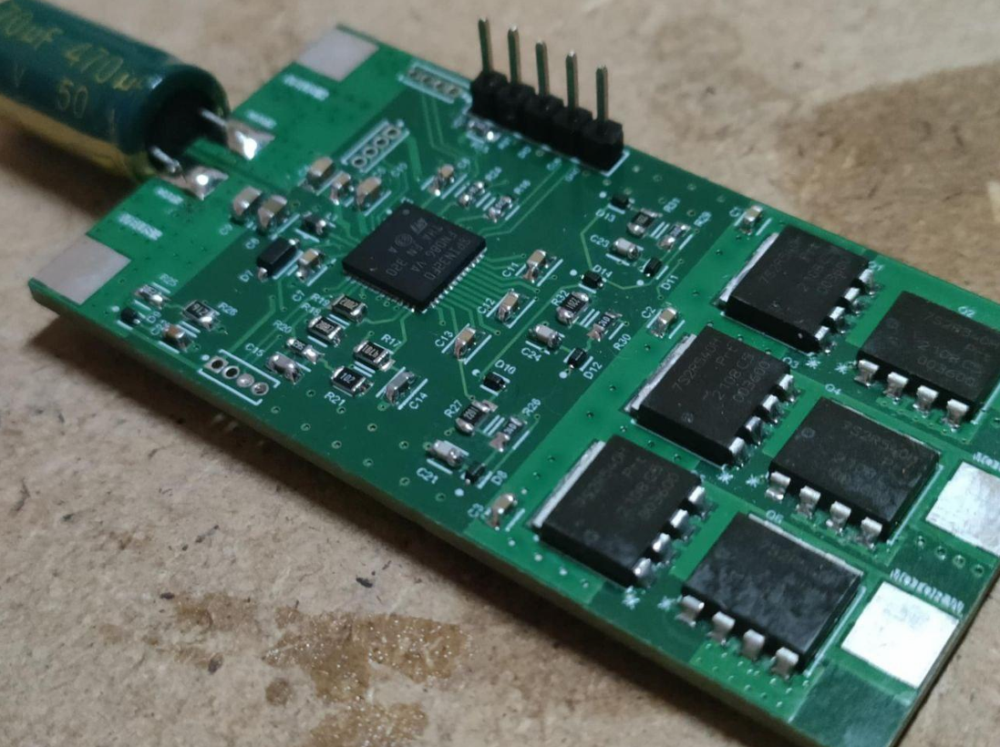
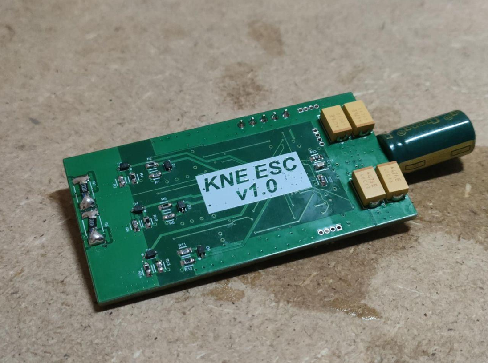
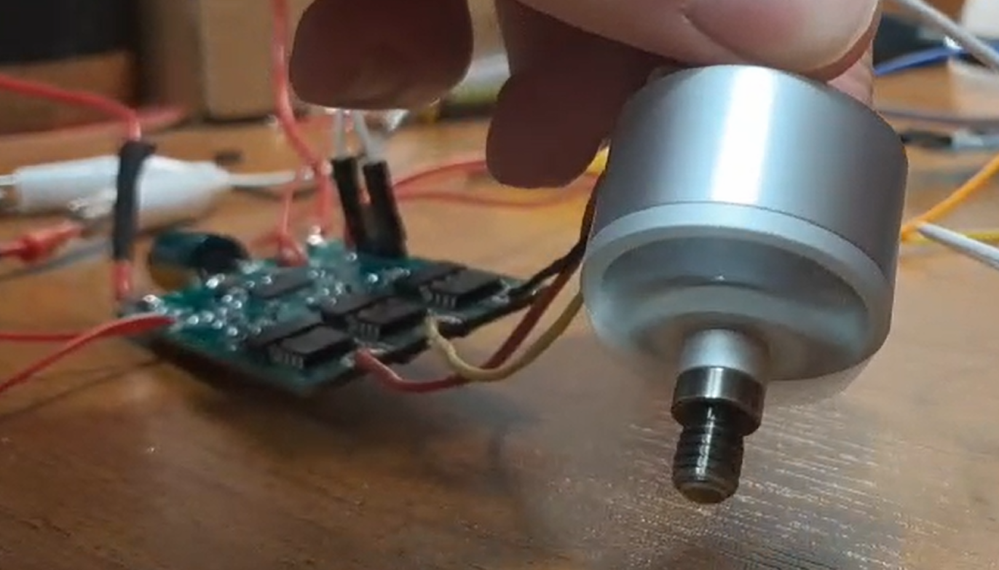

# ESC
Electronic speed control for BLDC motors with 6STEP algorithm.

## Hardware
Schematics and PCB project. ESC was based on STSPIN32F0A microcontroller and PSMNR55-40SSH MOSFETs.

## Firmware
Code for STSPIN32F0A in C. Implementation of a 6-step algorithm for controlling motor speed using the Motor SDK. Controlling motor speed with PWM and DShot protocol. UART interface for motor's telemetry.

## ESC Pilot
Python application that communicates with the ESC via UART, enabling motor testing, telemetry collection, and motor speed control.

## Images

